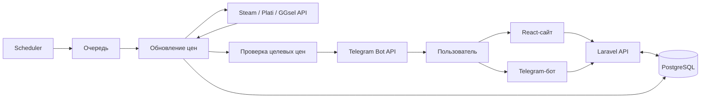

# Project Map: «Игроскан»

Короткая карта действующего проекта для человека без глубокого знания кода. Активный production-контур — React-сайт, Laravel API, PostgreSQL и Telegram-бот на aiogram. Папка `legacy/` содержит старую Python-реализацию и не должна использоваться как описание текущей архитектуры.

## 0. Иерархия репозитория

```text
igroscan/
├── backend/                 Laravel API и общая бизнес-логика
│   ├── app/
│   │   ├── Http/            HTTP-контроллеры и middleware
│   │   ├── Models/          Eloquent-модели
│   │   ├── Jobs/            фоновые задачи очереди
│   │   ├── Console/         команды scheduler/operations
│   │   └── Services/
│   │       ├── Admin/       роли, аудит и административные сводки
│   │       ├── Alerts/      настройки и вычисление ценовых сигналов
│   │       ├── Catalog/     поиск, классификация и релевантность офферов
│   │       ├── Pricing/     магазины, обновление цен и курсы валют
│   │       │   └── Adapters/ адаптеры источников к общему контракту
│   │       └── Telegram/    identity, объединение аккаунтов и уведомления
│   ├── database/            миграции, factories и seeders
│   ├── routes/              публичные и внутренние API-маршруты
│   └── tests/               Feature- и Unit-тесты
├── frontend/                React/Vite-клиент
│   └── src/
│       ├── app/             корневой App и глобальные стили
│       ├── features/        admin, alerts и catalog
│       ├── shared/          API-клиент, i18n, hooks и UI-примитивы
│       ├── assets/          статические ресурсы сборки
│       └── test/            общая настройка Vitest
├── bot/                     Telegram-адаптер
│   ├── src/igroscan_bot/
│   │   ├── api/             Laravel API client
│   │   └── presentation/    клавиатуры, тексты и карточки
│   ├── assets/              логотипы площадок и бота
│   └── tests/               изолированные unittest-тесты
├── deploy/                  Caddy, preflight, backup и runbook
├── scripts/                 служебные deployment-скрипты
├── docs/                    актуальная архитектурная документация
└── legacy/                  архивный Python-контур, не production
```

Правило размещения: код идёт в домен, который является основной причиной его изменения; общий технический код остаётся в `shared`/`Support`, а точки входа фреймворков — в их штатных каталогах.

## 1. Основные компоненты

| Компонент | Что делает | Где смотреть |
|---|---|---|
| Сайт | Поиск, карточки цен, регистрация, избранное, настройка алертов и кабинет | `frontend/src/app/App.tsx`, `frontend/src/features/` |
| Laravel API | Единая бизнес-логика для сайта и бота: пользователи, игры, цены, избранное, алерты, Telegram | `backend/routes/api.php`, `backend/app/Http/Controllers/Api/` |
| PostgreSQL | Хранит аккаунты, игры, текущие цены, наблюдения цен, избранное и события алертов | `backend/app/Models/`, `backend/database/migrations/` |
| Scheduler | Раз в минуту ищет источники, которые пора обновить; ежедневно чистит старую историю; ежечасно пишет operational snapshot | `backend/bootstrap/app.php` |
| Queue worker | Выполняет обновления источников и отправку Telegram-уведомлений вне пользовательского запроса | `backend/app/Jobs/`, `docker-compose.yml` |
| Telegram-бот | Второй интерфейс к тому же аккаунту и данным; работает polling-ом и обращается только к Laravel API | `bot/src/igroscan_bot/` |
| Edge/запуск | Docker Compose поднимает БД, API, сайт, scheduler, worker, Caddy, Cloudflare Tunnel и бота | `docker-compose.yml`, `deploy/Caddyfile`, `deploy/` |

## 2. Поток данных



Обычный поиск идёт так:

1. Сайт вызывает `GET /api/search`, затем `GET /api/prices`; бот использует аналогичные маршруты под `/api/internal/telegram/*`.
2. `StoredPriceSearchService` читает уже сохранённые цены из PostgreSQL. Внешние магазины не опрашиваются для каждой карточки.
3. Если игра ещё неизвестна, Steam используется для поиска кандидата, после чего заполнение цен ставится в очередь. Пользователь получает состояние «обновляется».
4. Scheduler и worker позже обновляют Steam, Plati и GGsel, сохраняют текущий срез и наблюдение цены, затем проверяют активные алерты.
5. При достижении цели создаётся одно событие и отдельная задача доставки отправляет сообщение через Telegram Bot API.

Ключевые точки: `backend/app/Http/Controllers/Api/PriceController.php`, `backend/app/Services/Catalog/StoredPriceSearchService.php`, `backend/app/Services/Pricing/GamePriceRefreshService.php`, `backend/app/Services/Alerts/AlertEvaluationService.php`.

## 3. Данные простыми словами

- `users` — общий аккаунт человека.
- `external_identities` — подтверждённая внешняя личность, сейчас Telegram; связывает Telegram-first профиль с аккаунтом сайта.
- `games` — одна каноническая запись игры по Steam AppID и её статус релиза.
- `game_source_states` — когда и с каким результатом обновлялся каждый источник.
- `current_game_prices` — последняя известная цена для комбинации «игра + источник + вид предложения».
- `game_price_observations` — накопленные наблюдения цен во времени.
- `favorites` — избранная игра конкретного пользователя.
- `favorite_alerts` — условие ценового сигнала (цена, скидка или новый минимум) и состояние `active`/`triggered`.
- `favorite_alert_scopes` — выбранные площадки и виды: `official`, `key`, `gift`, `account`, `rent`.
- `alert_events` и `alert_deliveries` — факт срабатывания и состояние отправки уведомления.
- `search_histories` — история поисков пользователя; это не история изменения цены.

Главные связи: пользователь имеет много избранных игр; у избранного один алерт; у алерта несколько scopes и по одному событию на каждый цикл активации.

## 4. Источники цен, API и парсинг

| Источник | Как получаются данные | Где |
|---|---|---|
| Steam | JSON API `storesearch` ищет кандидатов, `appdetails` возвращает карточку, RU-цену и `coming_soon` | `backend/app/Services/Pricing/SteamService.php` |
| Plati.Market | JSON API поиска `plati.market/api/search.ashx`, с резервным `plati.io` | `backend/app/Services/Pricing/PlatiService.php` |
| GGsel | JSON: поиск карточки `elastic/goods/query-categories` → её `digi_catalog` → товары `elastic/goods/categories` | `backend/app/Services/Pricing/GgselService.php` |

HTML-страницы магазинов не разбираются. «Парсинг» здесь означает нормализацию JSON-ответов и текстовую классификацию названий предложений. `Services/Catalog/Classifier.php` по словам определяет ключ, гифт, аккаунт или аренду; `Services/Catalog/OfferRelevance.php` отсеивает DLC, валюту, саундтреки и другие нерелевантные товары. Затем adapters группируют предложения и считают минимум, среднюю цену, самый дешёвый и популярный оффер: `backend/app/Services/Pricing/Adapters/`.

Внутренний API используется в двух местах: React обращается к публичным и авторизованным `/api/*`, Python-бот — к защищённым service token маршрутам `/api/internal/telegram/*`. Сам Laravel обращается наружу к трём источникам цен, Telegram OIDC и Telegram Bot API.

## 5. Связь сайта и Telegram

Сайт и бот не синхронизируют две независимые базы. Оба работают с Laravel и одним `user_id`. Бот передаёт Telegram user ID в закрытый internal API; `TelegramBotUserService` находит или создаёт Telegram-first аккаунт. Официальный Telegram-вход подтверждает identity, а `TelegramAccountMergeService` переносит в аккаунт сайта избранное, scopes, цели и историю событий. Уведомления отправляет Laravel job, а не процесс бота.

Ключевые файлы: `backend/app/Services/Telegram/TelegramBotUserService.php`, `backend/app/Services/Telegram/TelegramOidcService.php`, `backend/app/Services/Telegram/TelegramAccountMergeService.php`, `backend/app/Http/Controllers/Api/TelegramBotController.php`.

## 6. Риски и точки внимания

- Внешние API могут менять формат, ограничивать запросы или временно не отвечать; последняя успешная цена сохраняется, но может устареть.
- Классификация marketplace-офферов эвристическая: необычное название может получить неверный вид или быть отфильтровано.
- Весь фоновой контур зависит от трёх частей: scheduler, database queue и worker. Если одна остановлена, сайт продолжит показывать старые данные, а алерты задержатся.
- Для анонсированных игр Plati/GGsel намеренно не вызываются до обнаружения релиза в Steam.
- Наблюдения цен сохраняются, но полноценная пользовательская история изменения цены пока не выведена через сайт и бот.
- В настройках сайта Steam сейчас обязателен, хотя backend и бот допускают другие наборы scopes.
- Telegram OIDC, Bot API и internal API зависят от согласованных URL, токенов и username в environment; временный `trycloudflare.com` адрес может измениться.
- `legacy/` содержит старый backend с похожими сущностями и тестами. Изменения продукта следует делать в `backend/`, `frontend/` и `bot/`, если явно не поставлена задача по миграции legacy.

Спецификация MVP и история выполнения находятся в `.specs-fire/intents/unified-price-watchlist-mvp/` и `.specs-fire/runs/`; эксплуатационные процедуры — в `deploy/RELEASE_RUNBOOK.md`.
